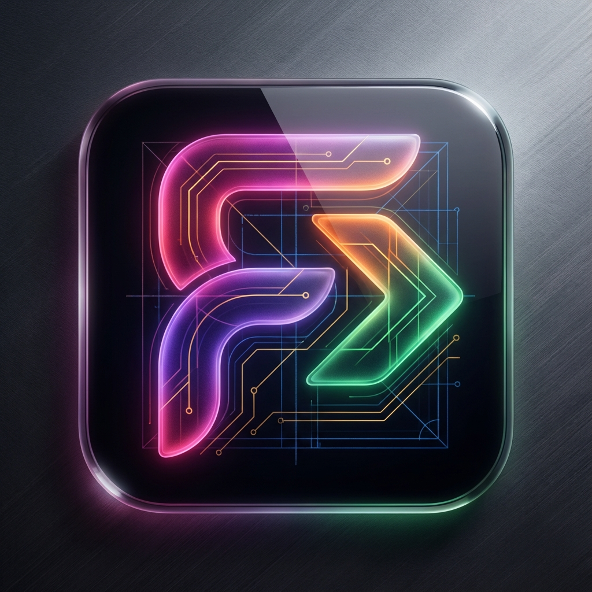

# Figmatic 🚀 (VS Code Extension)

  

[English](#english) | [Українська](#українська)

---

## English

### What is Figmatic?
**Figmatic** is an advanced AI-powered **VS Code Extension** that transforms Figma designs into production-ready React + SCSS code. It acts as a **Senior Frontend Architect**, interpreting design intent and planning modular component hierarchies.

### Key Features ✨
- **🛡️ Easy Setup**: Securely store your Gemini API Key in VS Code Settings.
- **🔗 Smart URL Parser**: Supports full Figma URLs; automatically extracts File IDs.
- **🏗️ Automated Bootstrapping**: Generates a complete **Vite + React + TypeScript** project with a single click.
- **⏱️ Live Progress & Timer**: Track every AI action in real-time with an estimated completion timer.
- **🧠 Senior Architect AI**: Generates semantic HTML5, BEM-styled SCSS, and modular React code.
- **🧹 Auto-Cleanup**: Smart project directory management to ensure a fresh start every time.
- **✨ AI Post-Generation Loop**: Proactive suggestions for performance, A11y, and feature improvements.

## 🚀 Quick Start

1. Install the extension.
2. Go to **VS Code Settings** and search for `Figmatic`. Enter your `Gemini API Key`.
3. Open the **Figmatic Sidebar** in the Activity Bar.
4. Paste your **Figma URL** (e.g., `https://www.figma.com/file/KEY/...`).
5. Click **Generate** and watch the magic happen!
6. Once finished, run `npm install` and `npm run dev` in the output folder.

### Technical Setup 🛠️

#### 1. Installation
- Clone the repository: `git clone https://github.com/AleksandrWeber/Figmatic.git`
- Install dependencies: `npm install`

#### 2. Configure API Keys
- **Gemini AI**: Open VS Code Settings (`Cmd+,`), search for "Figmatic", and enter your **Gemini API Key**.
- **Figma Token**: Create a `.env` file in the root or enter it directly in the extension sidebar.

#### 3. Development Mode
- Open the project in VS Code and press **F5**.
- In the new [Host] window, open the **Figmatic** icon in the sidebar.
- Paste your Figma URL and click **🚀 Generate**.

---

## Українська

### Що таке Figmatic?
**Figmatic** — це просунуте **розширення для VS Code** на базі ШІ, яке перетворює дизайни Figma на готовий до продакшену React + SCSS код. Figmatic працює як **Senior Frontend Architect**, аналізуючи структуру дизайну та створюючи модульну архітектуру компонентів.

### Основні можливості ✨
- **🛡️ Легке налаштування**: Зберігайте Gemini API Key безпечно у налаштуваннях VS Code.
- **🔗 Smart URL Parser**: Вставляйте повне посилання на Figma; ID витягнеться автоматично.
- **🏗️ Автоматичне розгортання**: Генерує повний **Vite + React + TypeScript** проект «під ключ».
- **⏱️ Живий прогрес та Таймер**: Слідкуйте за кожним кроком ШІ в реальному часі.
- **🧠 Senior Architect AI**: Семантичний HTML5, SCSS (BEM) та модульний React-код.
- **🧹 Розумне очищення**: Автоматичне прибирання старих асетів перед новою генерацією.
- **✨ Цикл вдосконалення**: Пост-генераційні поради від ШІ щодо A11y та швидкодії.

## 🚀 Швидкий старт

1. Встановіть розширення.
2. Перейдіть у **Налаштування VS Code**, знайдіть `Figmatic` і введіть ваш `Gemini API Key`.
3. Відкрийте **панель Figmatic** в Activity Bar.
4. Вставте **посилання на Figma** (наприклад, `https://www.figma.com/file/KEY/...`).
5. Натисніть **Generate** і спостерігайте за процесом!
6. Після завершення запустіть `npm install` та `npm run dev` у папці проекту.

### Технічне налаштування 🛠️

#### 1. Встановлення
- Клонуйте репозиторій: `git clone https://github.com/AleksandrWeber/Figmatic.git`
- Встановіть залежності: `npm install`

#### 2. Налаштування ключів
- **Gemini AI**: Відкрийте налаштування VS Code (`Cmd+,`), знайдіть "Figmatic" і введіть ваш **Gemini API Key**.
- **Figma Token**: Створіть файл `.env` або введіть токен безпосередньо в бічній панелі.

#### 3. Запуск у режимі розробки
- Відкрийте проект у VS Code та натисніть **F5**.
- У новому вікні знайдіть іконку **Figmatic** у бічній панелі.
- Вставте посилання на проект Figma та натисніть **🚀 Generate**.

---

## License & Copyright
Copyright (c) 2024 Oleksandr Shvachko. All rights reserved.
Personal use is allowed; commercial use prohibited without permission. See [LICENSE](LICENSE) for details.
